# Comparison of Search based Vs Sampling based motion planning algorithms

## Objective:
The objective of this project is to compare search based and sampling based motion planning algortihms.
In this project A* and RRT algorithms are compared. The A* algorithm's performance is further analysed by varying the heuristic fuctions. The comparison is done on 7 different environoments with 3-D obstracles.

## A* Vs RRT
- Below given images are of A* (left image) RRT(right image)
<div style="display: flex; justify-content: center;">
  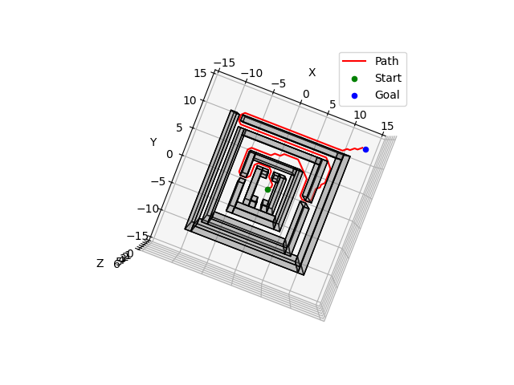
  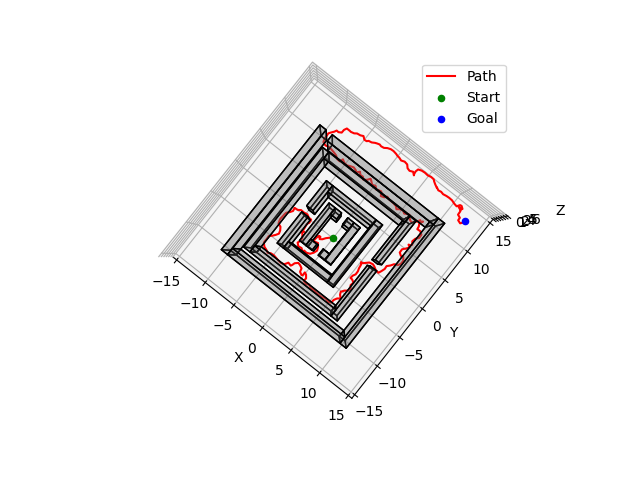
</div>
<br>
<div style="display: flex; justify-content: center;">
  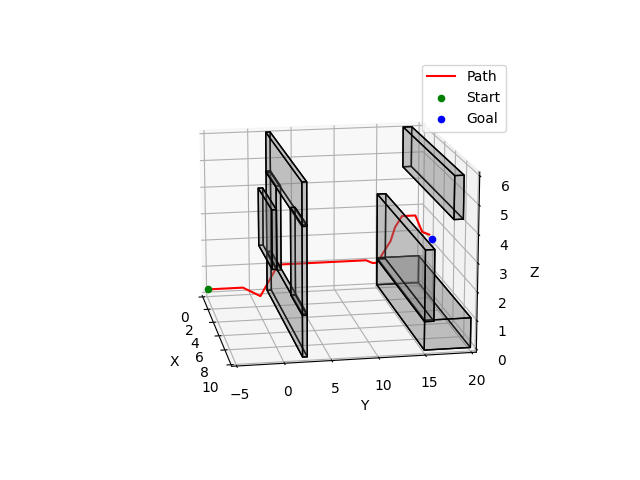
  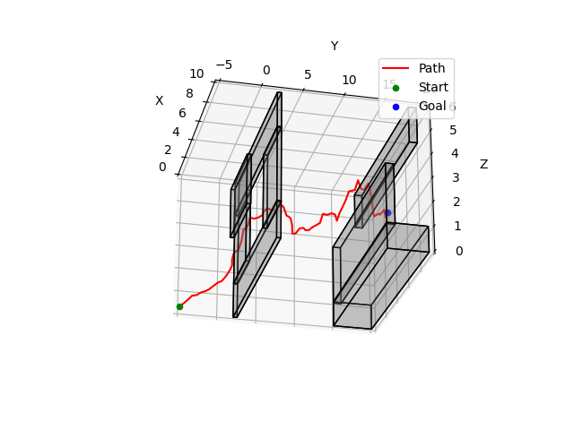
</div>
<br>
<div style="display: flex; justify-content: center;">
  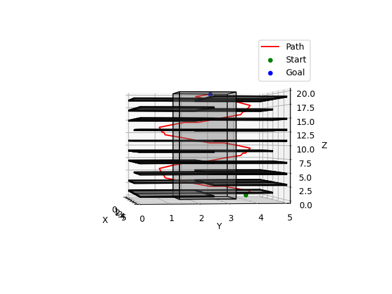
  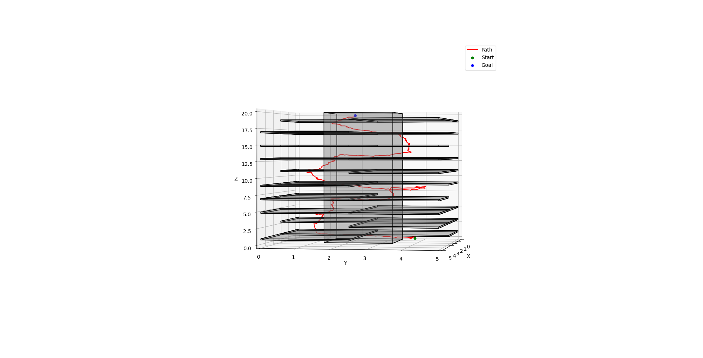
</div>
<br>
<div style="display: flex; justify-content: center;">
  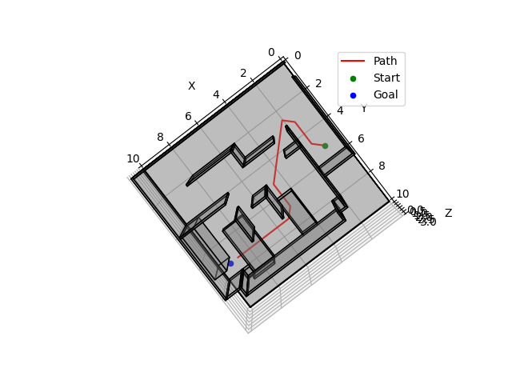
  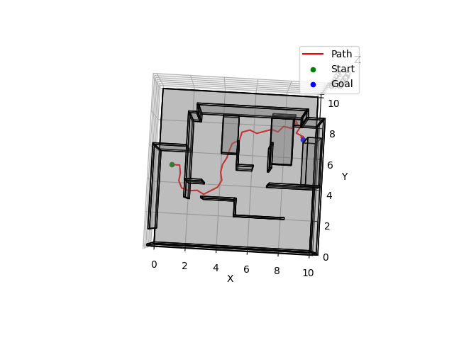
</div>
<br>
<div style="display: flex; justify-content: center;">
  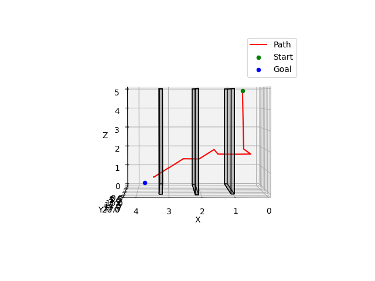
  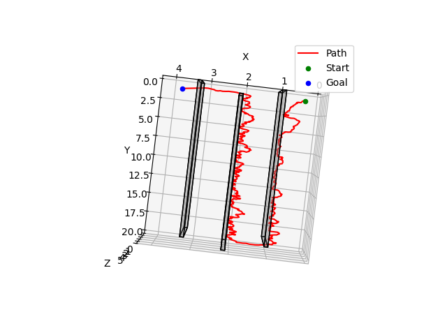
</div>
<br>
<div style="display: flex; justify-content: center;">
  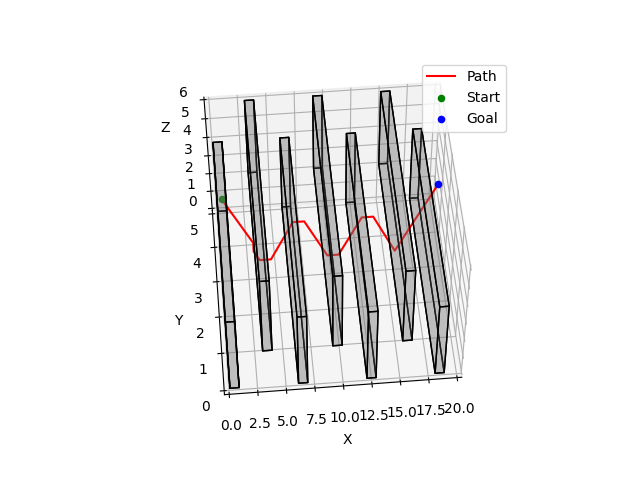
  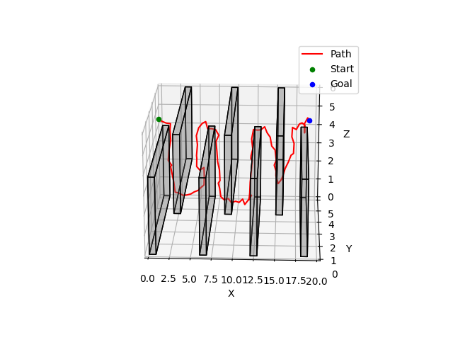
</div>
<br>


## Results:
<div style="display: flex; justify-content: center;">
  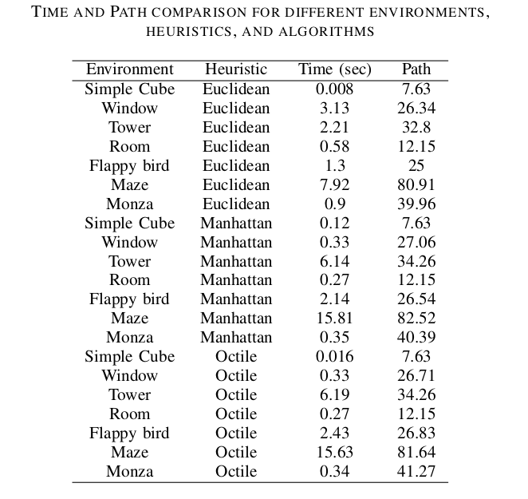
  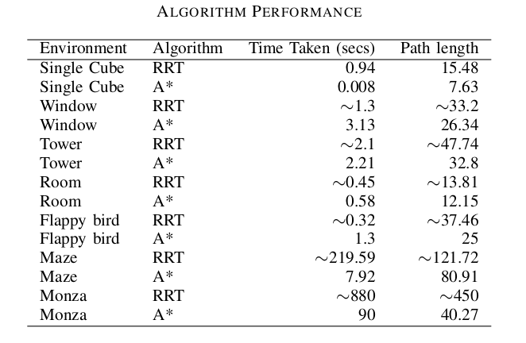
</div>

## Code and Installation:
1. Install the requirements
```bash
conda create --name env_motionPlanning
conda activate env_motionPlanning
git clone https://github.com/suryapilla/motion-planning.git
cd motion-planning
pip install -r requirements.txt

```
2. Adjust the config file to speciy heuristic, planner, environment or use the below command
```
python3 main.py --env <env name> --planner <choose planner>

```

Example: To choose tower environmnet and Astart planner use below command
```
python3 main.py --env tower --planner Astar
```

